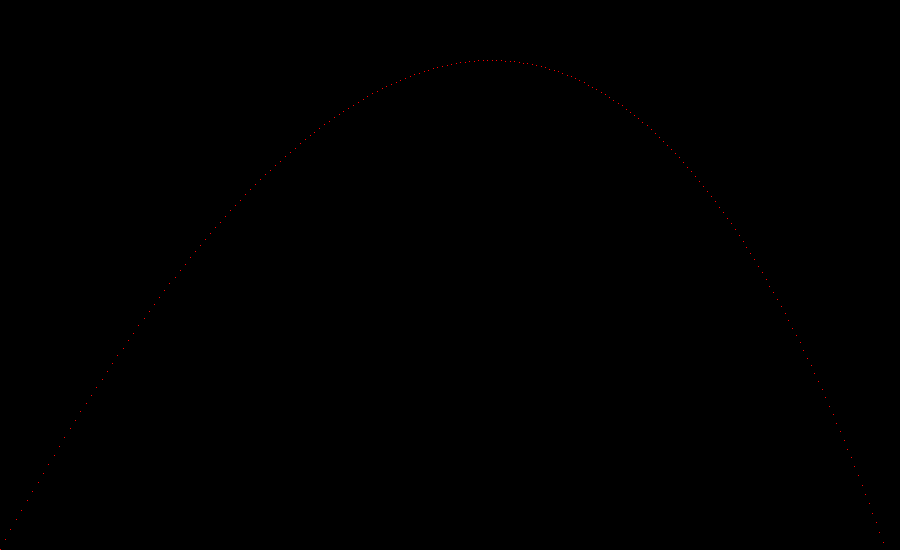

# raytracer-c

## Badges for CI build, static analysis, and code test coverage
[](https://github.com/twistdroach/raytracer-c/actions?query=workflow%3ACI)
[](https://codecov.io/gh/twistdroach/raytracer-c)
[](https://lgtm.com/projects/g/twistdroach/raytracer-c/context:cpp)

## Current interesting features
 * ([commit](https://github.com/twistdroach/raytracer-c/commit/595c005fdcf9f470f3911c22b6140c3465550fff), [commit](https://github.com/twistdroach/raytracer-c/commit/98fe9c79b22ff8ceb148cd8ebafbb9e2e580ca57), [commit](https://github.com/twistdroach/raytracer-c/commit/fd7b1612ee826a4fbac9c7dc6ce0a234a65c2201 )) Accelerated (algorithmically) using Bounded Volume Hierarchies (no kd trees yet)
 * ([commit](https://github.com/twistdroach/raytracer-c/commit/34ca0eb36e417ad1657fb17438d179eac5236f45 )) Multithreaded using OpenMP (can be disabled via CMake option)
 * ([commit](https://github.com/twistdroach/raytracer-c/commit/fcdb7cceb8586d99524d868ad38f0c41e904d809 )) Certain hot spots (only 1 so far that made sense) optimized using AVX2 intrinsics (again can be disabled via CMake)
 * ([commit](https://github.com/twistdroach/raytracer-c/commit/3590c195885751de5915b717887d4f7d47de3ffa )) Doxygen doc is generated if doxygen is found by CMake (need to find an easy way to host this)
 * Load Wavefront OBJ files (no MTL support yet though), with triangle smoothing via normal interpolation
 * Texture mapping now supported! (uncompressed PPM only)

## Geometry
 * Spheres, Pleanes, Cylinders, Cubes, & Cones
 * Triangles (and loading them from OBJ) files
 * Constructive Solid Geometry (CSG) allows composing complex shapes from the above primitives with three operations: Union, Intersection, and Difference
 * Groups to allow operations and materials to be applied to many primitives (or complex objects) at once

## Limitations/Future
 * Only single ~~point~~ light supported (lights with surface area now supported)
 * Need to make so sort of Render executable that would support a simple (yaml?) scene syntax
 * ~~Textures!~~
 * Various cleanup & documentation (see issues)

# Demo Executables 

## demo/sphere_spin

Simple spin of a camera around a sphere on a parametric path of the form
```
x(t) = 5*cos(t) - 2.5
y(t) = 5sin(2t)
```

[](https://youtu.be/22AllcUR0hk)

## demo/texture_map

This is to demonstrate a "skybox" or giant cube with a texture map on its surface.  The camera then rotates around a small reflective sphere at the center of the scene (both inside the cube).

[](https://www.youtube.com/watch?v=-bOzFtL1FAI)

## demo/parabola

simple demonstration of tuple implementation, shooting a projectile with gravity & wind vectors...



## demo/sphere_shadow

Matrix implementation allow us to cast rays...and intersect them with a sphere


## demo/phong_render_sphere

Phone shading!


## demo/phong_render_three_spheres

Multiple objects, but they are all spheres...Some are simply scaled to look flat.


## demo/phong_render_three_spheres (with shadows)

Same executable but now shadows are added...


## demo/phone_render_three_sphere_and_plane

Slightly newer executable but now with a plane instead of "squashed spheres"


## demo/phong_render_three_spheres_and_striped_plane

Very similar but now the plane has stripes.


## demo/reflection

Now the central sphere has a reflection...


## demo/refraction

Added a sphere with some refraction.  Need to make a better demo image.


## demo/refraction_cube

Added support for cubes, also allowing an object to opt out of shadow calculation.


## demo/refraction_cylinder

Added support for cylinders...


## demo/render_obj

Added support for triangles, loading obj files...

Command takes two parameters, the first is the file to load, the second is optional and allows you to scale loaded object.


## demo/render_obj

Now with normal interpolation...starting to slow down with lots of triangles/reflection/refraction...


An obvious performance improvement would be to add some group bounding, so we don't have to check all triangles for intersections when we aren't even close.

In any event, flamegraphs are a fun way to see what is going on.


## demo/csg

Add some constructive solid geometry - aka CSG...this is a sphere with a cubice bite taken out of it.


