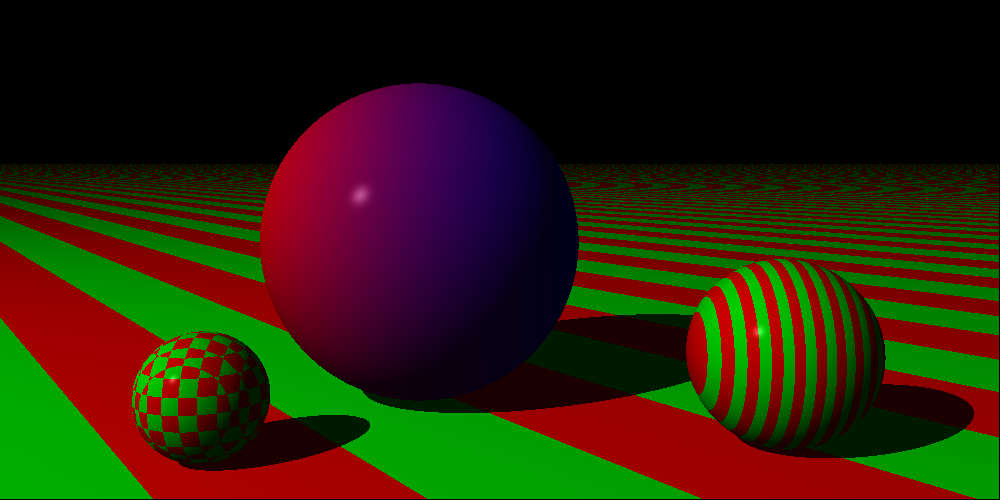

# raytracer-c

Current executables (and sample output) are:

## demo/parabola

simple demonstration of tuple implementation, shooting a projectile with gravity & wind vectors...

## demo/sphere_shadow

Matrix implementation allow us to cast rays...and intersect them with a sphere

## demo/phong_render_sphere

Phone shading!

## demo/phong_render_three_spheres

Multiple objects, but they are all spheres...Some are simply scaled to look flat.

## demo/phong_render_three_spheres (with shadows)

Same executable but now shadows are added...

## demo/phone_render_three_sphere_and_plane

Slightly newer executable but now with a plane instead of "squashed spheres"

## demo/phong_render_three_spheres_and_striped_plane

Very similar but now the plane has stripes.

## demo/reflection

Now the central sphere has a reflection...

## demo/refraction

Added a sphere with some refraction.  Need to make a better demo image.

## demo/refraction_cube

Added support for cubes, also allowing an object to opt out of shadow calculation.

## demo/refraction_cylinder

Added support for cylinders...

## demo/render_obj

Added support for triangles, loading obj files...

Command takes two parameters, the first is the file to load, the second is optional and allows you to scale loaded object.

## demo/render_obj

Now with normal interpolation...starting to slow down with lots of triangles/reflection/refraction...

An obvious performance improvement would be to add some group bounding, so we don't have to check all triangles for intersections when we aren't even close.

In any event, flamegraphs are a fun way to see what is going on.

## demo/csg

Add some constructive solid geometry - aka CSG...this is a sphere with a cubice bite taken out of it.

